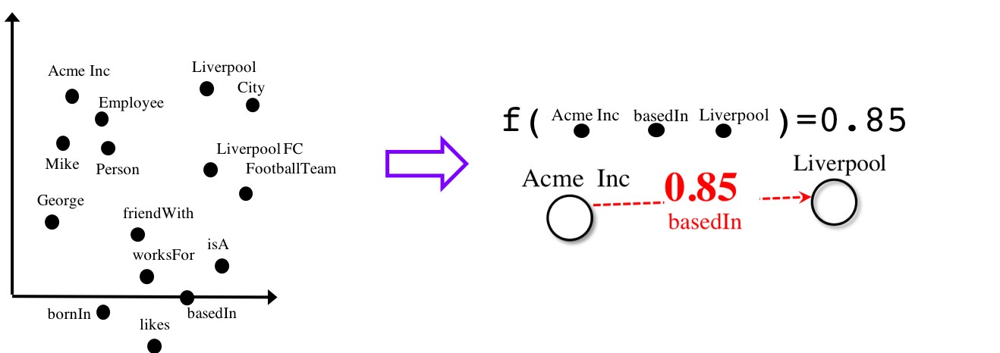

# AmpliGraph

**Open source Python library that predicts links between concepts in a knowledge graph.**

AmpliGraph is a suite of neural machine learning models for relational Learning, a branch of machine learning
that deals with supervised learning on knowledge graphs.


**Use AmpliGraph if you need to**:

* Discover new knowledge from an existing knowledge graph.
* Complete large knowledge graphs with missing statements.
* Generate stand-alone knowledge graph embeddings.
* Develop and evaluate a new relational model.


AmpliGraph's machine learning models generate **knowledge graph embeddings**, vector representations of concepts in a metric space:


It then combines embeddings with model-specific scoring functions to predict unseen and novel links:




## Key Features


* **Intuitive APIs**: AmpliGraph APIs are designed to reduce the code amount required to learn models that predict links in knowledge graphs.
* **GPU-Ready**: AmpliGraph is based on TensorFlow, and it is designed to run seamlessly on CPU and GPU devices - to speed-up training.
* **Extensible**: Roll your own knowledge graph embeddings model by extending AmpliGraph base estimators.


## System Architecture


AmpliGraph includes the following submodules:

* **KG Loaders**: Helper functions to load datasets (knowledge graphs).
* **Latent Feature Models**: knowledge graph embedding models. AmpliGraph contains: TransE, DistMult, ComplEx, ConvE, and RotatE.
* **Evaluation**: Metrics and evaluation protocols to assess the predictive power of the models.


# Installation

### Provision a Virtual Environment

**Installation using Anaconda is highly recommended.**

Create & activate Virtual Environment (conda)

```
conda create --name ampligraph python=3.6
source activate ampligraph
```

### Install TensorFlow

**CPU version**

```
pip install tensorflow
```

or you could install the version packaged with conda:

```
conda install tensorflow
```

**GPU version**

```
pip install tensorflow-gpu
```

or you could install the version packaged with conda:

```
conda install tensorflow-gpu
```


## Install the library


You can install the latest stable release of AmpliGraph with `pip`, using the latest wheel (0.3.0) published by Dublin Labs:
*Note this work only from within the Dublin Labs network*

```
pip install http://dubaldeweb001.techlabs.accenture.com/wheels/ampligraph/ampligraph-0.3.dev0-py3-none-any.whl
```

If instead you want the most recent development version, you can clone the repository
and install from source (this will pull the latest commit on `develop` branch).
The code snippet below will install the library in editable mode (`-e`):

```
git clone https://github.com/Accenture/AmpliGraph.git
cd AmpliGraph
pip install -e .
```

## Download the Datasets

Datasets can be downloaded from [Google Drive](https://drive.google.com/drive/folders/16GBu89NCVyyYetry91tMntzpV_mSQ-gK?usp=sharing).
Once downloaded, decompress the archives.

**You must also set the following environment variable:**

OSX/Linux:
```
export AMPLIGRAPH_DATA_HOME=/YOUR/PATH/TO/datasets
```

Windows:
```
setx AMPLIGRAPH_DATA_HOME /YOUR/PATH/TO/datasets
```

## Sanity Check

```python
>> import ampligraph
>> ampligraph.__version__
'0.3-dev'
```

## Predictive Power Evaluation (MRR Filtered)

|          |FB15k |WN18   |WN18RR |FB15K-237|
|----------|------|-------|-------|---------|
| TransE   | 0.55 | 0.50  | 0.23  | 0.27(p) |
| DistMult | 0.79 | 0.83  | 0.44  | 0.26(s) |
| ComplEx  | 0.79 | 0.94  | 0.44  | 0.27(s) |
| HolE     | 0.80 | 0.94  | 0.47  | 0.20(n) |
| RotatE   | .??  | .??   | .??   | .??     |

##  Documentation

**[Latest documentation available here](http://10.106.43.211/docs/ampligraph/dev/index.html)**


The project documentation can be built with Sphinx:

```
cd docs
make clean autogen html
```

## Tests


```
pytest -s tests
```

